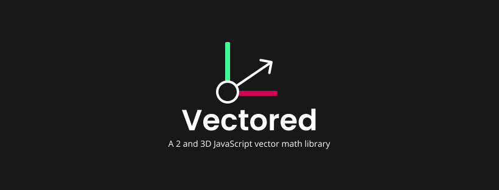

# Vectored

A JavaScript 2 and 3D vector math library

## Installation

### Node.js

```
npm install vectored
```

```js
const Vec = require('./vec.js');

let vector = new Vec(4, 2, 0);
```

### In browser

Include the script inside the html

<!-- adding a version to the url is HIGHLY recomended and will prevent changes to this library from breaking your app -->

```html
<!-- Link to file directly -->

<script src="./vec.js"></script>

<!-- or latest via url -->

<script src="https://cdn.jsdelivr.net/npm/vectored@latest/dist/vec.min.js"></script>

<!-- or to a more specific version-->

<script src="https://cdn.jsdelivr.net/npm/vectored@1.0/dist/vec.min.js"></script>

<!-- you can use vec.js here -->

<script src="/"></script>
```

## How to use

**Creating a vector**

```js
let vec1 = new Vec(3, 4);
```

**Adding vectors**

```js
let vec1 = new Vec(3, 5);
let vec2 = new Vec(2, 1);

vec1.add(vec2);
console.log(vec1);
// -> Vec {x: 5, y: 6, z: 0}
```

For all vector opperations and explenations see [the full documentations](https://github.com/Vuurvos1/vectored/blob/main/docs/documentation.md)

<!-- add typescript typing -->
<!-- maybe split vector 2 and vector 3 functionality into own classes (Vec2, Vec3)? -->

## Documentation

[link to documentation](https://github.com/Vuurvos1/vectored/blob/main/docs/documentation.md)

## License

Licensed by [MIT](https://github.com/Vuurvos1/vectored/blob/main/LICENSE)
